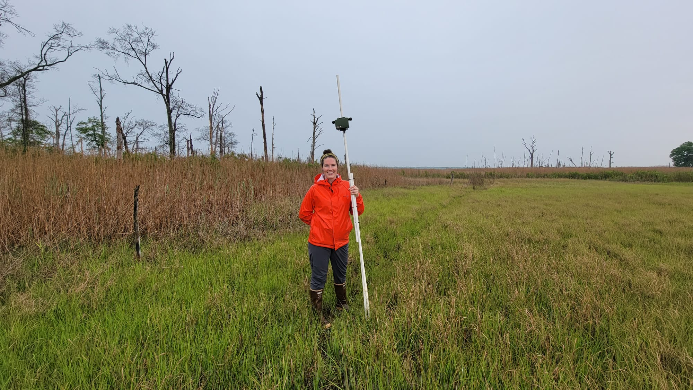

```{r setup, include=FALSE}
knitr::opts_chunk$set(echo = TRUE)
```

# Purpose
This project analyzes acoustic monitoring data to assess patterns in species detections and call durations.

```{r Purpose, out.width='50%', fig.align='center'}
#| fig.cap="Image 1. Field deployment of an acoustic recording unit (ARU) in a coastal marsh habitat. This photograph highlights the setup of the ARU on a PVC mounting pole, used for long-term acoustic monitoring of wetland soundscapes. Photo by Theodore Diehl."


```

# Methods
INCLUDE METHODS HERE!!!!!!!!

## Data Handling

Clear Environment

```{r, warning=FALSE, message=FALSE}
rm(list=ls())
```

Load Packages

```{r, warning=FALSE, message=FALSE}
library(ggplot2)
library(tidyverse)
library(lubridate)
library(scales)
library(ggpubr)
library(rstatix)
library(ggpmisc)
library(tibble)
library(timetk)
library(plotly)
library(dplyr)
library(tidyr)
library(RColorBrewer)
library(grid)
library(png)
library(ggimage)
library(hms)
library(cowplot)
library(data.table)
library(viridis)
#maps
library(leaflet)
library(leaflet.extras)
library(leaflet.providers)
library(htmltools)
library(sf)
#diel and activity overlaps
library(camtrapR)
library(fmsb)
#summary
library(vtable)
#audio will turn on if necessary
library(embed)
```

Load Data

*NOTE: Use data prep scripts first before loading data! Will need to run the Arbimon Data Prep Script to get the Recordings.csv file.*

Run for all
```{r Loading All, include=FALSE}
aru_locations<- read.csv("../Metadata/Acoustic Project Sites.csv", header=TRUE, sep = ",", stringsAsFactors=FALSE)
```

Arbimon
```{r Loading Arbimon, include=FALSE}

recording_metadata<- read.csv("../Data/Arbimon Data/Recording_Metadata.csv", header=TRUE, sep = ",", stringsAsFactors=FALSE)
pm_results<- read.csv("../Data/Arbimon Data/pattern_matching_rois.0001.csv", header=TRUE, sep = ",", stringsAsFactors=FALSE)
species_metadata<- read.csv("../Data/Arbimon Data/species.0001.csv", header=TRUE, sep = ",", stringsAsFactors=FALSE)

# lubridate formatting
recording_metadata$datetime <- ymd_hms(recording_metadata$datetime)
```

Kaleidoscope
```{r Loading Kaleidoscope, include=FALSE}

index_data <- read.csv("../Data/aru_data_twilight.csv", header=TRUE, sep = ",", stringsAsFactors=FALSE)
# lubridate formatting
index_data$DATETIME <- ymd_hms(index_data$DATETIME)
index_data$DATE<- ymd(index_data$DATE)
index_data$TIME <- as.POSIXct(index_data$TIME, format="%H:%M:%S")
```

Data Wrangling - Yeehaw!

Arbimon
```{r YeeHaw Arbimon, include=FALSE}

# create a new dataframe that has the species IDs with metadata associated with it
species_ID1<- merge(pm_results, species_metadata, by = "species_id")
species_IDs <- merge(species_ID1, recording_metadata, by = "recording_id")          

```

Kaleidoscope
```{r YeeHaw Kaleidoscope, include=FALSE}
avg_index <- index_data %>%   dplyr::group_by(DATETIME, DATE, SITE, STATION, DEPLOYMENT) %>%
          dplyr::summarize(avg_NDSI = mean(NDSI, na.rm = TRUE),
                   sd_NDSI=sd(NDSI,na.rm = T)/sqrt(length(NDSI)),
                  avg_ACI = mean(ACI, na.rm= TRUE),
                   sd_ACI=sd(ACI,na.rm = T)/sqrt(length(ACI)),
                  avg_ADI = mean(ADI, na.rm= TRUE),
                   sd_ADI=sd(ADI,na.rm = T)/sqrt(length(ADI)),
                  avg_AEI = mean(AEI, na.rm= TRUE),
                   sd_AEI=sd(AEI,na.rm = T)/sqrt(length(AEI)),
                  avg_BI = mean(BI, na.rm= TRUE),
                   sd_BI=sd(BI,na.rm = T)/sqrt(length(BI)))
  
month_avg_index <- index_data %>% 
          mutate(MONTH = floor_date(DATETIME, "month")) %>%
            dplyr::group_by(MONTH, STATION) %>%
            dplyr::summarize(avg_NDSI = mean(NDSI, na.rm = TRUE),
                   sd_NDSI=sd(NDSI,na.rm = T)/sqrt(length(NDSI)),
                  avg_ACI = mean(ACI, na.rm= TRUE),
                   sd_ACI=sd(ACI,na.rm = T)/sqrt(length(ACI)),
                  avg_ADI = mean(ADI, na.rm= TRUE),
                   sd_ADI=sd(ADI,na.rm = T)/sqrt(length(ADI)),
                  avg_AEI = mean(AEI, na.rm= TRUE),
                   sd_AEI=sd(AEI,na.rm = T)/sqrt(length(AEI)),
                  avg_BI = mean(BI, na.rm= TRUE),
                   sd_BI=sd(BI,na.rm = T)/sqrt(length(BI)))
  
day_avg_index <- index_data %>%     
           mutate(DAY = floor_date(DATETIME, "day")) %>%
            dplyr::group_by(DAY, STATION) %>%
            dplyr::summarize(avg_NDSI = mean(NDSI, na.rm = TRUE),
                   sd_NDSI=sd(NDSI,na.rm = T)/sqrt(length(NDSI)),
                  avg_ACI = mean(ACI, na.rm= TRUE),
                   sd_ACI=sd(ACI,na.rm = T)/sqrt(length(ACI)),
                  avg_ADI = mean(ADI, na.rm= TRUE),
                   sd_ADI=sd(ADI,na.rm = T)/sqrt(length(ADI)),
                  avg_AEI = mean(AEI, na.rm= TRUE),
                   sd_AEI=sd(AEI,na.rm = T)/sqrt(length(AEI)),
                  avg_BI = mean(BI, na.rm= TRUE),
                   sd_BI=sd(BI,na.rm = T)/sqrt(length(BI))) %>% 
  mutate(Site_Type = case_when(
    STATION == "RF_01" ~ "Reference",
    STATION == "RF_02" ~ "Reference",
    STATION == "GAR_01" ~ "Wild Card",
    STATION == "GAR_02" ~ "Restoration",
    STATION == "GAR_03" ~ "Wild Card",
    STATION == "GAR_04" ~ "Restoration")
    %>% as.factor())

station_avg_index <- index_data %>% 
            dplyr::group_by(STATION) %>%
            dplyr::summarize(avg_NDSI = mean(NDSI, na.rm = TRUE),
                   sd_NDSI=sd(NDSI,na.rm = T)/sqrt(length(NDSI)),
                  avg_ACI = mean(ACI, na.rm= TRUE),
                   sd_ACI=sd(ACI,na.rm = T)/sqrt(length(ACI)),
                  avg_ADI = mean(ADI, na.rm= TRUE),
                   sd_ADI=sd(ADI,na.rm = T)/sqrt(length(ADI)),
                  avg_AEI = mean(AEI, na.rm= TRUE),
                   sd_AEI=sd(AEI,na.rm = T)/sqrt(length(AEI)),
                  avg_BI = mean(BI, na.rm= TRUE),
                   sd_BI=sd(BI,na.rm = T)/sqrt(length(BI))) %>% 
  mutate(Site_Type = case_when(
    STATION == "RF_01" ~ "Reference",
    STATION == "RF_02" ~ "Reference",
    STATION == "GAR_01" ~ "Wild Card",
    STATION == "GAR_02" ~ "Restoration",
    STATION == "GAR_03" ~ "Wild Card",
    STATION == "GAR_04" ~ "Restoration")
    %>% as.factor())

year_avg_index <- index_data %>%     
           mutate(YEAR = floor_date(DATETIME, "year")) %>%
            dplyr::group_by(YEAR, STATION) %>%
            dplyr::summarize(avg_NDSI = mean(NDSI, na.rm = TRUE),
                   sd_NDSI=sd(NDSI,na.rm = T)/sqrt(length(NDSI)),
                  avg_ACI = mean(ACI, na.rm= TRUE),
                   sd_ACI=sd(ACI,na.rm = T)/sqrt(length(ACI)),
                  avg_ADI = mean(ADI, na.rm= TRUE),
                   sd_ADI=sd(ADI,na.rm = T)/sqrt(length(ADI)),
                  avg_AEI = mean(AEI, na.rm= TRUE),
                   sd_AEI=sd(AEI,na.rm = T)/sqrt(length(AEI)),
                  avg_BI = mean(BI, na.rm= TRUE),
                   sd_BI=sd(BI,na.rm = T)/sqrt(length(BI)))

index_timeofday<-index_data %>% 
    dplyr::group_by(Twilight, DATE, STATION) %>%
    dplyr::summarize(avg_NDSI = mean(NDSI, na.rm = TRUE),
                   sd_NDSI=sd(NDSI,na.rm = T)/sqrt(length(NDSI)),
                  avg_ACI = mean(ACI, na.rm= TRUE),
                   sd_ACI=sd(ACI,na.rm = T)/sqrt(length(ACI)),
                  avg_ADI = mean(ADI, na.rm= TRUE),
                   sd_ADI=sd(ADI,na.rm = T)/sqrt(length(ADI)),
                  avg_AEI = mean(AEI, na.rm= TRUE),
                   sd_AEI=sd(AEI,na.rm = T)/sqrt(length(AEI)),
                  avg_BI = mean(BI, na.rm= TRUE),
                   sd_BI=sd(BI,na.rm = T)/sqrt(length(BI)))

index_timeofday$Twilight<-factor(index_timeofday$Twilight, levels=c("morning","mid-day","evening", "night"))
index_timeofday$DATE<-ymd(index_timeofday$DATE)
```

# Site Map

Spatial formatting

```{r Map set up}

# Center Coordinates
maplng <- -75.15925 #adjust when possible
maplat <- 39.045748 #adjust when possible

# Convert to sf object
locations_sf<-vegdatajoin3 %>%  #adjust where this data is coming from
  st_as_sf(coords=c("E","N"), crs=6527)

#check projections
#mapview(locations_sf) 

# Extract transformed coordinates
locations_projected<-locations_sf %>% 
  st_transform(crs=4326) %>% 
  mutate(Long=st_coordinates(.)[,1],
         Lat=st_coordinates(.)[,2]
  )

css_fix <- "div.info.legend.leaflet-control br {clear: both;}" # CSS to correct spacing
html_fix <- htmltools::tags$style(type = "text/css", css_fix)  # Convert CSS to HTML
```

## Site Map

```{r Map Sites, dpi=300, warning=FALSE, message=FALSE}

leaflet(data = locations_projected, height = 725, width = "100%") %>%
  setView(lng = maplng, lat = maplat, zoom = 10) %>%
  addProviderTiles(providers$Esri.WorldImagery) %>%
  addCircleMarkers(~Long, ~Lat,
    radius = 3,
    fillColor = ~ pal(name), #adjusted already
    stroke = TRUE,
    color = "white",
    weight = 0.75,
    fillOpacity = 0.75,
    popup = ~ paste("<strong> ARU Location: </strong>", Point_ID,"<br>") #adjust
  ) %>% 
  addLegend(
    "bottomright",
    pal = pal,
    values = ~ as.factor(),#maybe in here it can be restoration or control
    opacity = .98,
    title = "ARU Location"
  )
```

## Recording Schedule Graphics

Visualization of recording periods per year. 
This is based off of the recording data extracted from Arbimon, but applies to all the analyzed data. It is the backbone information to put all the indices and species IDs in context.
```{r Recording Graphics, echo=TRUE, fig.height=10, fig.width=15}
#| fig.cap= "Figure 1. Activity periods for each autonomous recorder in 2023. Each recorder is represented by a horizontal segment, and individual detection events are marked by colored points along the Julian day axis."

# 2023 Recording Schedule
ggplot(recording_metadata %>% filter (Year == "2023", name != "TEST Bait Site (Throwaway)"), aes(x = Julian_Day, y = name)) +
  geom_segment(aes(xend = Julian_Day, yend = name), color = "gray") +  
  geom_point(aes(color = as.factor(name)), size = 4) +  
  scale_color_viridis_d() +  
  scale_x_continuous(breaks = seq(0, 365, by = 5)) + 
  labs(x = "Julian Day", y = "Recorder (Site ID)",
       title = "Julian Days Each Recorder Was Active in 2023") +
  theme_minimal(base_size = 15) +
  theme(panel.grid.major.y = element_blank())+
  theme(legend.position = "none")

#| fig.cap= "Figure 2. Activity periods for each autonomous recorder in 2024. Each recorder is represented by a horizontal segment, and individual detection events are marked by colored points along the Julian day axis.."

# 2024 Recording Schedule
ggplot(recording_metadata %>% filter (Year == "2024"), aes(x = Julian_Day, y = name)) +
  geom_segment(aes(xend = Julian_Day, yend = name), color = "gray") +  
  geom_point(aes(color = as.factor(name)), size = 4) +  
  scale_color_viridis_d() +  
  scale_x_continuous(breaks = seq(0, 365, by = 5)) + 
  labs(x = "Julian Day", y = "Recorder (Site ID)",
       title = "Julian Days Each Recorder Was Active in 2024") +
  coord_cartesian(xlim = c(115, 255)) +
  theme_minimal(base_size = 15) +
  theme(panel.grid.major.y = element_blank())+  
  theme(legend.position = "none")

```

# Overview of Species Presence

## Saltmarsh Sparrow Detections

```{r SALS Graphics, echo=TRUE, fig.height=10, fig.width=15}

sparrow_image <- png::readPNG("C:/Users/kfaller/Documents/GitHub/Acoustics/Images/SALS.png")  # Load your image
sparrow_grob <- rasterGrob(sparrow_image, interpolate = TRUE)

#| fig.cap= "Figure 3. Daily presence and absence of Saltmarsh Sparrows (Ammospiza caudacuta) at monitored sites in 2024. Green tiles represent days when sparrows were detected, while gray tiles show absences. A sparrow illustration is included for visual context."

ggplot(species_IDs %>% filter(scientific_name == "Ammospiza caudacuta", Year == "2024"), 
    aes(x = Julian_Day, y = name, fill = factor(validated))) +
    geom_tile(color = "white") +  
    scale_fill_manual(values = c("0" = "gray", "1" = "darkgreen"), name = "Presence") + 
    scale_x_continuous(breaks = seq(0, 365, by = 5)) + 
    labs(x = "Julian Day", y = "Site ID", title = "2024 Saltmarsh Sparrow Presence/Absence") +
    theme_bw(base_size = 15)+
    annotation_custom(sparrow_grob, xmin=160, xmax=175, ymin=0, ymax=3)

#| fig.cap= "Figure 4. Daily presence and absence of Saltmarsh Sparrows (Ammospiza caudacuta) at monitored sites in 2023. Green tiles represent days when sparrows were detected, while gray tiles show absences. A sparrow illustration is included for visual context."

  ggplot(species_IDs %>% filter(scientific_name == "Ammospiza caudacuta", Year == "2023"), 
         aes(x = Julian_Day, y = name, fill = factor(validated))) +
    geom_tile(color = "white") +  
    scale_fill_manual(values = c("0" = "gray", "1" = "darkgreen"), name = "Presence") + 
    scale_x_continuous(breaks = seq(0, 365, by = 5)) +  
    labs(x = "Julian Day", y = "Site ID", title = "2023 Saltmarsh Sparrow Presence/Absence") +
    theme_bw(base_size = 15)+
    annotation_custom(sparrow_grob, xmin=160, xmax=175, ymin=0, ymax=3)
  
```

## Nelson's Sparrow
```{r NESP Graphics, echo=TRUE, fig.height=10, fig.width=15}

#| fig.cap= "Figure 4. Daily presence and absence of Nelson's Sparrows (Ammospiza nelsoni) at monitored sites in 2023. Green tiles represent days when sparrows were detected, while gray tiles show absences. A sparrow illustration is included for visual context."

  ggplot(species_IDs %>% filter(scientific_name == "Ammodramus nelsoni", Year == "2023"), 
         aes(x = Julian_Day, y = name, fill = factor(validated))) +
    geom_tile(color = "white") +  
    scale_fill_manual(values = c("0" = "gray", "1" = "darkgreen"), name = "Presence") + 
    scale_x_continuous(breaks = seq(0, 365, by = 5)) +  
    labs(x = "Julian Day", y = "Site ID", title = "2023 Nelson's Sparrow Presence/Absence") +
    theme_bw(base_size = 15)+
    annotation_custom(sparrow_grob, xmin=155, xmax=170, ymin=0, ymax=3) 
```

# Overview of Acoustic Index Results

We are using Wildlife Acoustics' Kaleidoscope software to take our raw audio files and output numerical values for different aspects of the soundscape for each file.
Those values were then averaged to reduce the noise of the data. The indices we are including are:

- BI: Bioacoustic Index
- ADI: Average Diversity Index
- AEI: Average Evenness Index
- ACI: Acoustic Complexity Index
- NDSI: Normalized Difference Soundscape Index aka Anthropogenic Disturbance

The ACI (Pieretti et al. 2011) measures the variability within biotic sounds while ignoring anthropogenic noise. BI (Boelman et al. 2007) measures the number of frequency bands used by birds and is a proxy for avian abundance. NDSI (Kasten et al. 2012), which will be of considerable importance to our urban-to-rural gradient objectives, estimates the level of anthropogenic disturbance (i.e., noise pollution) in the soundscape. This model creates a ratio of human-generated to biological sound. Finally, ADI (Villanueva-Rivera et al. 2011), is derived from Shannon Diversity and calculates the diversity of sound. After our deployments, a large dataset will be produced, tracking these indices across our sites over time.

## Averages for Indices

```{r Averages Graphics 1, echo=FALSE, fig.height=10, fig.width=15}

#| fig.cap= "Figure 5. Daily average Acoustic Complexity Index (ACI) values for each monitoring station, shown with lines and points. Data spans multiple days, with each station differentiated by color."

ggplot(data= day_avg_index, aes(x= DAY, y= avg_ACI, color= STATION))+ 
         geom_line(size=1.5)+
         geom_point(size= 4)+
         theme_bw(base_size=15)+
         ggtitle("Daily Average Acoustic Complexity")+
         labs(x= "Date", y= "ACI")+ 
         scale_x_datetime(date_breaks =  "1 day")+ 
         theme(axis.text.x = element_text(angle = 90, vjust = 0.5, hjust=1))
```

```{r Averages Graphics 2, echo=FALSE, fig.height=10, fig.width=15}

#| fig.cap= "Figure 6: Daily average acoustic evenness across sites. Higher numbers represent a more even soundscape. A healthy ecosystem should have low evenness. High evenness scores could be reflecting high rates of anthropogenic disturbance or low biodiversity." 

ggplot(data= day_avg_index, aes(x= DAY, y= avg_AEI, color= STATION))+ 
         geom_line(size=1.5)+
         geom_point(size= 4)+
         theme_bw(base_size=15)+
         ggtitle("Daily Average Acoustic Evenness")+
         labs(x= "Date", y= "AEI")+ 
         scale_x_datetime(date_breaks =  "1 day")+ 
         theme(axis.text.x = element_text(angle = 90, vjust = 0.5, hjust=1))
```

```{r Averages Graphics 3, echo=FALSE, fig.height=10, fig.width=15}

#| fig.cap= "Figure 7: Daily average acoustic diversity across sites. Higher numbers represent a more diverse soundscape. A healthy ecosystem should have high diversity. High diversity scores could be reflecting a more biodiverse community. The y axis is on a natural log scale with a 2.3 being the highest diversity possible. This index is the closest to Shannon Diversity. Includes all recorded sounds (including any anthropogenic disturbance) giving a value for the entire soundscape, rather than just the biological diversity." 

# NOTE: Check that the 2.3 is in fact the highest number, it hasn't in the past. I need to adjust the caption

ggplot(data= day_avg_index, aes(x= DAY, y= avg_ADI, color= STATION))+ 
         geom_line(size=1.5)+
         geom_point(size= 4)+
         theme_bw(base_size=15)+
         ggtitle("Daily Average Acoustic Diversity")+
         labs(x= "Date", y= "ADI")+ 
         scale_x_datetime(date_breaks =  "1 day")+ 
         theme(axis.text.x = element_text(angle = 90, vjust = 0.5, hjust=1))
```

```{r Averages Graphics 4, echo=FALSE, fig.height=10, fig.width=15}

#| fig.cap= "Figure 8: Daily average acoustic biodiversity across sites. Higher numbers represent a more diverse soundscape. This differs from the diversity index because it excludes anthropogenic disturbance making this a better index to understand the biophony of a site (or biological soundscape)."

ggplot(data= day_avg_index, aes(x= DAY, y= avg_BI, color= STATION))+ 
         geom_line(size=1.5)+
         geom_point(size= 4)+
         theme_bw(base_size=15)+
         ggtitle("Daily Average Biodiversity")+
         labs(x= "Date", y= "BI")+ 
         scale_x_datetime(date_breaks =  "1 day")+ 
         theme(axis.text.x = element_text(angle = 90, vjust = 0.5, hjust=1))
```

```{r Averages Graphics 5, echo=FALSE, fig.height=10, fig.width=15}

#| fig.cap= "Figure 9: Daily average anthropogenic disturbance across sites. Lower numbers represent a more anthropogenic disturbance in the soundscape. -1 represents 100% anthropogenic sounds and 1 would be 100% biological sounds."

ggplot(data= day_avg_index, aes(x= DAY, y= avg_NDSI, color= STATION))+ 
         geom_line(size=1.5)+
         geom_point(size= 4)+
         theme_bw(base_size=15)+
         ggtitle("Daily Average Anthropogenic Disturbance")+
         labs(x= "Date", y= "NDSI")+ 
         scale_x_datetime(date_breaks =  "1 day")+ 
         theme(axis.text.x = element_text(angle = 90, vjust = 0.5, hjust=1))
```
Box Plots
```{r box 1, include=FALSE, echo=FALSE, fig.height=10, fig.width=15}
avg_index2 <- avg_index %>% 
  mutate(Site_Type = case_when(
    STATION  == "RF_01" ~ "Reference",
    STATION  == "RF_02" ~ "Reference",
    STATION  == "GAR_01" ~ "Wild Card",
    STATION  == "GAR_02" ~ "Restoration",
    STATION  == "GAR_03" ~ "Wild Card",
    STATION  == "GAR_04" ~ "Restoration")
    %>% as.factor()) 

#| fig.cap= "Figure 10: Boxplot of daily average Acoustic Complexity Index (ACI) across stations, grouped by site type. ACI represents the complexity of the acoustic environment, with higher values indicating more complex soundscapes."

ggplot(avg_index2, aes(x = STATION, y = avg_ACI, fill = STATION)) + 
  geom_boxplot(position = position_dodge()) +
  facet_wrap(~Site_Type, scales= "free_x")+
         theme_bw(base_size=17)+
         ggtitle("Acoustic Complexity Across Site Types")+
         labs(x= "Station", y= "ACI")
```

```{r box 2, include=FALSE, echo=FALSE, fig.height=10, fig.width=15}
#| fig.cap= "Figure 11: Boxplot of daily average Bioacoustic Index (BI) across stations, grouped by site type. Higher BI values suggest more biological activity within the soundscape."

ggplot(avg_index2, aes(x = STATION, y = avg_BI, fill = STATION)) + 
  geom_boxplot(position = position_dodge()) +
  facet_wrap(~Site_Type, scales= "free_x")+
         theme_bw(base_size=17)+
         ggtitle("Bioacoustics Across Site Types")+
         labs(x= "Station", y= "BI")
```

```{r box 3, include=FALSE, echo=FALSE, fig.height=10, fig.width=15}
#| fig.cap= "Figure 12: Boxplot of daily average Acoustic Diversity Index (ADI) across stations, grouped by site type. ADI is an indicator of soundscape diversity, reflecting both natural and anthropogenic sound contributions."

ggplot(avg_index2, aes(x = STATION, y = avg_ADI, fill = STATION)) + 
  geom_boxplot(position = position_dodge()) +
  facet_wrap(~Site_Type, scales= "free_x")+
         theme_bw(base_size=17)+
         ggtitle("Acoustic Diversity Across Site Types")+
         labs(x= "Station", y= "ADI")
```

Cowplot for Average Indices
*One graphic showing most important acoustic indices in one overview.*

```{r moo, echo=TRUE, fig.height=18, fig.width=15, dev=c('png', 'pdf', 'svg', 'tiff'), dpi=300}

day_avg_aci<- ggplot(data= day_avg_index, aes(x= DAY, y= avg_ACI, color= STATION, shape= Site_Type))+ 
         geom_line(size=1)+
         geom_point(size= 3)+
         theme_bw(base_size=18)+
         ggtitle("Daily Average Indices")+
         labs(x= " ", y= "ACI - Complexity")+ 
         scale_x_datetime(date_breaks =  "1 day")+ 
         theme(axis.text.x = element_text(angle = 90, vjust = 0.5, hjust=1))+
         guides(color = guide_legend(title = "Station"), shape = guide_legend(title = "Site Type"))

day_avg_bi<- ggplot(data= day_avg_index, aes(x= DAY, y= avg_BI, color= STATION, shape= Site_Type))+ 
         geom_line(size=1)+
         geom_point(size= 3)+
         theme_bw(base_size=18)+
         labs(x= " ", y= "BI - Bioacoustics")+ 
         scale_x_datetime(date_breaks =  "1 day")+ 
         theme(axis.text.x = element_text(angle = 90, vjust = 0.5, hjust=1))+
         guides(color = guide_legend(title = "Station"), shape = guide_legend(title = "Site Type"))

day_avg_ndsi<- ggplot(data= day_avg_index, aes(x= DAY, y= avg_NDSI, color= STATION, shape= Site_Type))+ 
         geom_line(size=1)+
         geom_point(size= 3)+
         theme_bw(base_size=18)+
         labs(x= " ", y= "NDSI - Anthropogenic Disturbance")+ 
         scale_x_datetime(date_breaks =  "1 day")+ 
         theme(axis.text.x = element_text(angle = 90, vjust = 0.5, hjust=1))+
         guides(color = guide_legend(title = "Station"), shape = guide_legend(title = "Site Type"))+ scale_y_reverse()

#| fig.cap= "Figure 13: Daily average values of three acoustic indices—Acoustic Complexity Index (ACI), Bioacoustic Index (BI), and Normalized Difference Soundscape Index (NDSI)—across different stations and site types. Colors represent recording stations, while shapes denote site types. The y-axis for NDSI is reversed to highlight increasing anthropogenic disturbance. Data are shown for each day in the monitoring period.”

plot_grid(day_avg_aci, 
         day_avg_bi,
         day_avg_ndsi,
          nrow= 3, align = "v", axis="l",
          labels="AUTO")

```

```{r moo2 ,echo=TRUE,fig.height=10, fig.width=15}
my_comparisons <- list(c("GAR_01", "RF_02"),
                       c("GAR_01", "RF_01"),
                       c("GAR_02", "RF_02"),
                       c("GAR_04", "RF_02"),
                       c("GAR_02", "RF_01"),
                       c("GAR_01", "GAR_04"), 
                       c("RF_01", "RF_02"),
                       c("GAR_04", "RF_01"), 
                       c("GAR_04", "GAR_02"),
                       c("GAR_01", "GAR_02")
                       )

box_avg_aci<- ggplot(day_avg_index, aes(x=STATION, y=avg_ACI, color= STATION))+ 
         geom_boxplot()+
         theme_bw(base_size=15)+
         labs(x= " ", y= "ACI - Complexity")+ 
         guides(color=FALSE)+
         stat_compare_means(label="p.format", method="t.test", comparisons = my_comparisons,
                            symnum.args = list(cutpoints = c(0, 0.05, 1), symbols = c("**", "-")))+  
         stat_compare_means(method = "anova", label.y = +Inf, vjust=1,hjust=-0.4)+
         theme(axis.text.x = element_text(angle = 90, vjust = 0.5, hjust=1))

box_avg_bi<- ggplot(day_avg_index, aes(x=STATION,y= avg_BI, color= STATION))+ 
         geom_boxplot()+
         theme_bw(base_size=15)+
         labs(x= " ", y= "BI - Bioacoustics")+ 
         guides(color=FALSE)+
         stat_compare_means(label="p.format", method="t.test", comparisons = my_comparisons,
                            symnum.args = list(cutpoints = c(0, 0.05, 1), symbols = c("**", "-")))+ 
         stat_compare_means(method = "anova", label.y = +Inf, vjust=1,hjust=-0.5)+       
         theme(axis.text.x = element_text(angle = 90, vjust = 0.5, hjust=1))

box_avg_ndsi<- ggplot(day_avg_index, aes(x=STATION,y= avg_NDSI, color= STATION))+ 
         geom_boxplot()+
         theme_bw(base_size=15)+
         labs(x= " ", y= "NDSI - Anthropogenic Disturbance")+ 
         guides(color=FALSE)+
         stat_compare_means(label="p.format", method="t.test", comparisons = my_comparisons,
                            symnum.args = list(cutpoints = c(0, 0.05, 1), symbols = c("**", "-")))+ 
         stat_compare_means(method = "anova", label.y = +Inf, vjust=1,hjust=-0.4)+
         theme(axis.text.x = element_text(angle = 90, vjust = 0.5, hjust=1))

#| fig.cap= "Figure 14: Boxplots of daily average values for three acoustic indices—Acoustic Complexity Index (ACI), Bioacoustic Index (BI), and Normalized Difference Soundscape Index (NDSI)—across different recording stations. Pairwise t-tests (displayed with p-values) and an overall ANOVA are used to assess differences between stations. Double asterisks (**) denote statistically significant comparisons (p < 0.05)."

plot_grid(box_avg_aci, 
         box_avg_bi,
         box_avg_ndsi,
          nrow= 1, align = "v", axis="l",
          labels="AUTO")
```

## Temporal Differences in Acoustic Index Values

```{r  moo3, echo=TRUE,fig.height=10, fig.width=15}

my_comparisons1 <- list(c("morning", "mid-day"),
                       c("morning", "evening"),
                       c("morning", "night"),
                       c("mid-day", "evening"),
                       c("evening", "night"),
                       c("mid-day", "night"))

box_avg_aci_tod<- ggplot(index_timeofday, aes(x=Twilight, y=avg_ACI, fill=Twilight))+ 
         geom_boxplot()+
         theme_bw(base_size=15)+
         labs(x= " ", y= "ACI - Complexity")+ 
         guides(fill=FALSE)+
         stat_compare_means(method="t.test",comparisons = my_comparisons1)+ 
         scale_fill_manual(values=c("lightsteelblue","skyblue3","dodgerblue4","navyblue"))+
         theme(axis.text.x = element_text(angle = 90, vjust = 0.5, hjust=1))

box_avg_bi_tod<- ggplot(index_timeofday, aes(x=Twilight,y= avg_BI, fill=Twilight))+ 
         geom_boxplot()+
         theme_bw(base_size=15)+
         labs(x= " ", y= "BI - Bioacoustics")+ 
         guides(fill=FALSE)+
         stat_compare_means(method="t.test",comparisons = my_comparisons1)+ 
         scale_fill_manual(values=c("lightsteelblue","skyblue3","dodgerblue4","navyblue"))+ 
         theme(axis.text.x = element_text(angle = 90, vjust = 0.5, hjust=1))

box_avg_ndsi_tod<- ggplot(index_timeofday, aes(x=Twilight,y= avg_NDSI, fill=Twilight))+ 
         geom_boxplot()+
         theme_bw(base_size=15)+
         labs(x= " ", y= "NDSI - Anthropogenic Disturbance")+ 
         guides(fill=FALSE)+
         stat_compare_means(method="t.test",comparisons = my_comparisons1)+ 
         scale_fill_manual(values=c("lightsteelblue","skyblue3","dodgerblue4","navyblue"))+ 
         theme(axis.text.x = element_text(angle = 90, vjust = 0.5, hjust=1))

#| fig.cap= "Figure 15: Boxplots of daily average values for three acoustic indices—Acoustic Complexity Index (ACI), Bioacoustic Index (BI), and Normalized Difference Soundscape Index (NDSI)—across four times of day: morning, mid-day, evening, and night. Pairwise t-tests assess differences between times of day, with significant differences highlighted. Color intensity reflects the time of day, from lighter to darker blues."

plot_grid(box_avg_aci_tod, 
         box_avg_bi_tod,
         box_avg_ndsi_tod,
          nrow= 1, align = "v", axis="l",
          labels="AUTO")
```

## Polar plots
These polar bar plots show the daily average Acoustic Complexity Index (ACI) values across different times of day at restoration and reference sites. By plotting in polar coordinates, we visualize how acoustic complexity shifts throughout the day, highlighting cyclic patterns. Colors represent the different times of day, from morning to evening.
```{r polar 1, echo=TRUE,fig.height=10, fig.width=15}

#| fig.cap= "Figure 16: Polar bar plot of daily average Acoustic Complexity Index (ACI) at restoration sites (GAR_01, GAR_02, GAR_04) across different times of day, excluding night. Color intensity reflects the time of day."

ggplot(filter(index_timeofday, Twilight!="night"&STATION%in%c("GAR_01","GAR_02","GAR_04")), aes(x=DATE, y=avg_ACI, fill=Twilight))+
  geom_bar(stat="identity")+
  coord_polar()+
  theme_bw()+
  scale_x_date(labels=date_format("%b-%d"),date_breaks =  "1 day")+
  scale_fill_manual(values=c("lightsteelblue","skyblue3","dodgerblue4","navyblue"))+
  labs(title="Restoration sites") 
```

```{r polar 2, echo=TRUE,fig.height=10, fig.width=15}
#| fig.cap= "Figure 17: Polar bar plot of daily average Acoustic Complexity Index (ACI) at reference sites (RF_01, RF_02) across different times of day, excluding night. Color intensity reflects the time of day."

ggplot(filter(index_timeofday, Twilight!="night"&STATION%in%c("RF_01","RF_02")), aes(x=DATE, y=avg_ACI, fill=Twilight))+
  geom_bar(stat="identity")+
  coord_polar()+
  theme_bw()+
  scale_x_date(labels=date_format("%b-%d"),date_breaks =  "1 day")+
  scale_fill_manual(values=c("lightsteelblue","skyblue3","dodgerblue4","navyblue"))+
  labs(title="Reference sites")
```
## Faceted Acoustic Complexity by Site and Time of Day

This figure shows daily average Acoustic Complexity Index (ACI) values at each monitoring station. The plots are faceted by both station and time of day (Twilight periods), with point sizes reflecting the magnitude of ACI. This visualization helps identify station-specific and diurnal patterns in acoustic complexity.
```{r, echo=TRUE,fig.height=10, fig.width=15}

#| fig.cap= "Figure 18: Daily average Acoustic Complexity Index (ACI) values at all monitoring stations, faceted by station and time of day (Twilight). Point size represents mean ACI, and Julian day is shown on the x-axis."

ggplot(index_timeofday, aes(x=DATE, y=avg_ACI, color=STATION))+
  facet_grid(STATION~Twilight)+
  geom_point(aes(size=avg_ACI))+
  theme_bw()+
  theme(legend.position="bottom")+
  labs(y="Mean ACI - complexity", x="Julian day", color="")+
  scale_x_date(date_labels = "%j")+
  scale_size_continuous(range = c(1, 3.5))+
  guides(size=FALSE, color=FALSE)

```

## Hourly Acoustic Patterns Across Stations

These heatmaps display daily patterns of three key acoustic indices:
- **Acoustic Complexity Index (ACI)**: Complexity of the soundscape.
- **Bioacoustic Index (BI)**: Presence of biological sounds.
- **Normalized Difference Soundscape Index (NDSI)**: Balance between biological and anthropogenic sounds.

Each row shows hourly data (y-axis) for each station (faceted), with Julian day on the x-axis. Color gradients reveal how these indices shift over time, providing insights into daily acoustic activity and disturbance levels.
```{r LH4, echo=TRUE,fig.height=10, fig.width=15}

a<-ggplot(index_data,aes(x=DATE,y=hour(TIME),fill=ACI))+
  facet_wrap(~STATION, ncol=1)+
  geom_raster()+
  theme_classic()+
  theme(legend.position="bottom")+
  scale_fill_viridis(option ="turbo",limits = c(92, 1565))+
  scale_x_date(date_labels = "%j")+
  labs(x="Julian day", y="Hour of the day", fill="ACI", title="Complexity")

b<-ggplot(index_data,aes(x=DATE,y=hour(TIME),fill=BI))+
  facet_wrap(~STATION, ncol=1)+
  geom_raster()+
  theme_classic()+
  theme(legend.position="bottom")+
  scale_fill_viridis(option ="rocket",limits = c(14,251))+
  scale_x_date(date_labels = "%j")+
  labs(x="Julian day", y="Hour of the day", fill="BI", title="Bioacoustics")

c<-ggplot(index_data,aes(x=DATE,y=hour(TIME),fill=NDSI))+
  facet_wrap(~STATION, ncol=1)+
  geom_raster()+
  theme_classic()+
  theme(legend.position="bottom")+
  scale_fill_viridis(option ="mako",limits = c(-1,1))+
  scale_x_date(date_labels = "%j")+
  labs(x="Julian day", y="Hour of the day", fill="NDSI", title="Anthropogenic Disturbance")

#| fig.cap= "Figure 19: Daily acoustic indices—Acoustic Complexity Index (ACI), Bioacoustic Index (BI), and Normalized Difference Soundscape Index (NDSI)—visualized as hourly heatmaps across stations. Colors show index intensity, with time of day on the y-axis and Julian day on the x-axis."

plot_grid(a, 
         b,
         c,
          ncol= 3,
          labels="AUTO")
```

<div class="tocify-extend-page" data-unique="tocify-extend-page" style="height: 0;"></div>